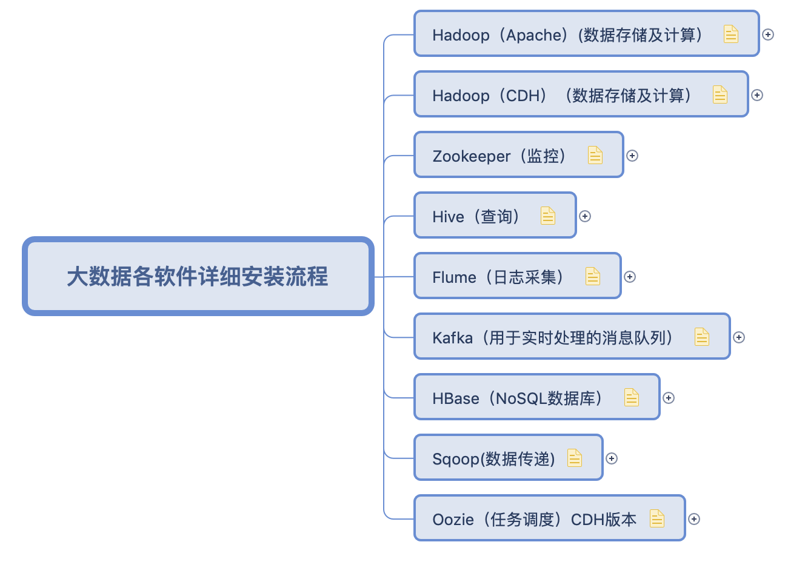
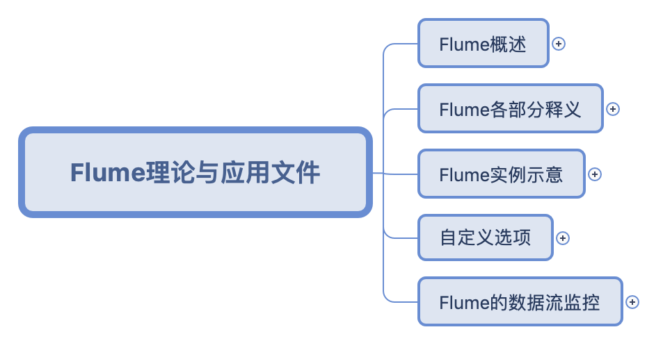
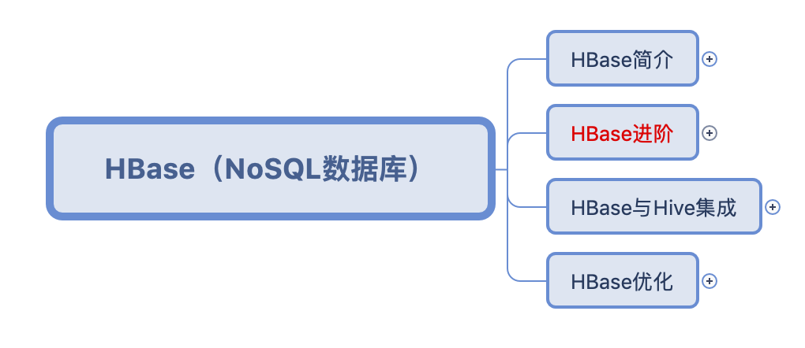
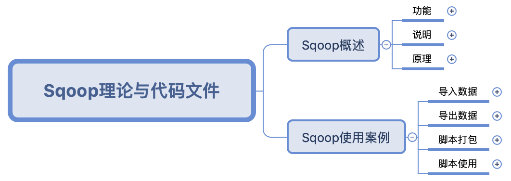

# Read me		

这是一份有关于大数据生态圈学习过程中各类知识点整理的思维导图，目前更新到 **Oozie** 阶段。

针对每一个框架，思维导图的思路如下：

1.每一个框架我都会整理两个文件：理论文件和代码文件。（如无代码文件需要我会专门说明）

2.在理论文件中，我会解释清楚每个框架运作的原理，相应需要注意的细节点。在此部分中将不会或很少会出现代码。

3.在代码文件中，基于理论文件的理解，我会将理论文件中每一部分的功能具体实现写明，以便于在工作中可以直接查询或使用。

说明：红色标记的是重要点

## 索引

[TOC]

## 大数据软件装配

目前更新到 **Oozie** 阶段

> 工欲善其事，必先利其器。

其中我的配置环境是：

`CentOs 6.8`

`Hadoop Apache 2.7.2`

`Zookeeper 3.4.10`

`Hive 1.2.1`

`Flume 1.7.0`

`Kafka 2.11-0.11.0.2`

`HBase 1.3.1`

`Sqoop 1.4.6`

`Oozie 4.0.0`

## Hadoop

### HDFS

#### 理论文件

HDFS 是 Hadoop 的基石，因此我把 Hadoop 的概述与它进行了合并，作为一个小简介，从而引出 HDFS 。

#### 代码文件

已更新，主要是hadoop在shell命令行中的一些常用命令整理归纳

#### 备注

一些有关于 HDFS 的内容以及现有的知识结构图我不是很满意，在未来的版本会有更新，在近期内会进行更改一次。

### MapReduce

#### 理论文件

MapReduce 是 Hadoop 中的分布式计算系统，在之后的内容中，有许多框架都是基于 MapReduce 所进行的，比如 Oozie ，比如 Hive ，因而理解 MapReduce 的原理是非常必要的。

#### 代码文件

暂无

#### 备注

MapReduce 的知识框架整理方面，还是存在一些代码混杂于理论文件之中的情况，在接下来的版本中应该会对这一点进行更新。

## Zookeeper

### 理论文件

Zookeeper 的主要目的是为了监控集群中的修改操作，它的架设与操作都非常简单，因此 **Zookeeper 只有理论文件**，在理论中，尤其要注意理解的是它的监听器原理和选举机制（类 Paxos 算法）。

## Hive

### 理论与代码文件

Hive 的情况恰恰与 Zookeeper 相反，Hive 作为一个基于 Hadoop 的数仓工具，其原理运作并不难，即底层基于 MapRuduce 的类 SQL 查询工具，因此 Hive 更注重的是代码文件，其中 4 ~ 9 章我以 sql 整理出来。

## Flume

### 理论与代码文件

Flume是一个基于流式架构数据采集、聚合和传输系统，因而它实用性较强，通过source ，channel，sink 进行控制。所以我把它理论和代码文件归并。

## Kafka

正在整理中，待更新

## HBase

### 理论文件

HBase 作为基于 hadoop 的 NoSQL 数据库，其原理性和操作性的要求都比较强，在原理阶段讲解了 HBase 的逻辑结构和物理存储结构，以及针对于其结构进行优化的的操作手段。

### 代码文件

HBase的代码文件是基于HbaseAPI操作搭建了一个微博项目，项目源码已写好，但具体分析文件还在制作中。

## Sqoop

### 理论与代码文件

Sqoop 是一个用于 Hadoop 和关系型数据库数据互导的小框架，其原理就是讲导入导出操作译作 MapReduce 语言，最关键的操作就是根据其语法进行脚本写作，因而理论与代码文件合并，同时整理出了 Sqoop 的常用命令。

## Oozie

### 理论与代码文件

Oozie 是一个任务调度的小框架，其原理是把 xml 语言转译为 mapreduce 程序来做，但 Oozie1 只有 Map 阶段，此处我们归纳总结的是 Oozie1。

