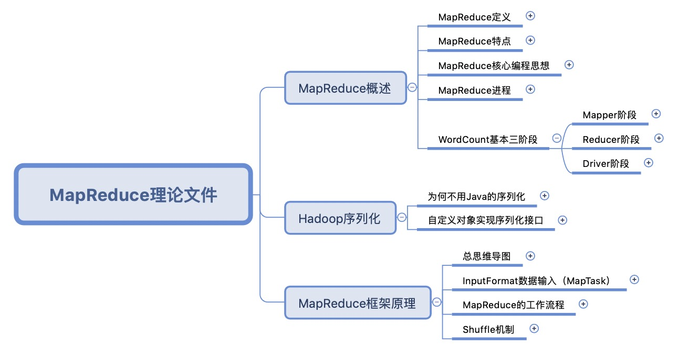

# Read me		

​		Some Xmind files about Hadoop（HDFS，MapReduce，more and more）

## HDFS

​		First of all，We need to learn some overviews of Hadoop. Because of this, I add some Hadoop knowledge into the file ”HDFS理论文件“, for example:

​		The main function of HDFS is to store data.It means that HDFS is the cornerstone of Big Data.

​		Maybe Some HDFS`s content will be updated in the future, but now I think it basically explained how HDFS works.

​		

## MapReduce

​		Then,  MapReduce is a very important part in Hadoop for Distributed Computing, So we aslo need to learn its Working Mechanism.

