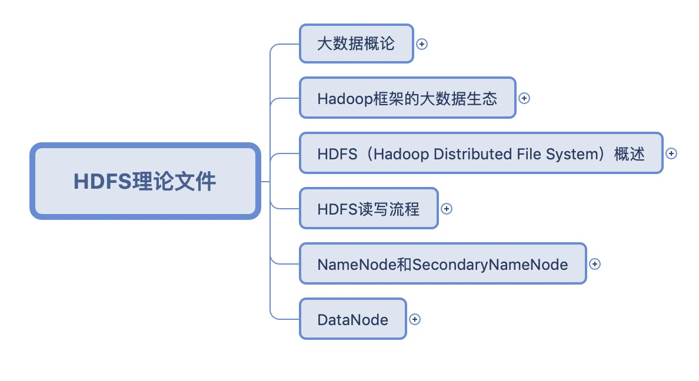
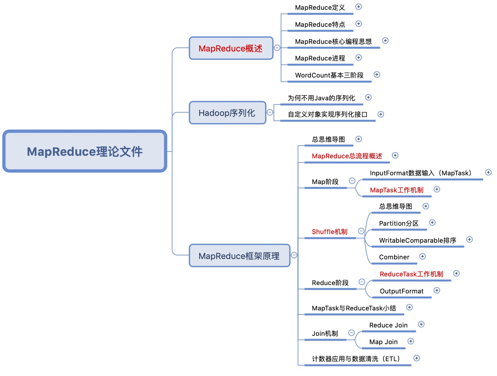

# Read me		

这是一份有关于Hadoop学习过程中各类知识点整理的思维导图，目前更新到MapReduce阶段。

针对每一个框架，思维导图的思路如下：

1.每一个框架我都会整理两个文件：理论文件和代码文件。

2.在理论文件中，我会解释清楚每个框架运作的原理，相应需要注意的细节点。在此部分中将不会或很少会出现代码。

3.在代码文件中，基于理论文件的理解，我会将理论文件中每一部分的功能具体实现写明，以便于在工作和代码使用中可以直接使用。

说明：红色标记的是重要点

## HDFS

### 理论文件

HDFS是Hadoop的基石，因此我把Hadoop的概述与它进行了合并，作为一个小简介，从而引出HDFS。

### 代码文件

暂无，主要是shell方面的使用

### 结语

一些有关于HDFS的内容以及现有的知识结构图我不是很满意，在未来的版本会有更新，在近期内会进行更改一次。

## MapReduce

### 理论文件

MapReduce是Hadoop中的分布式计算系统，尽管之后它被Spark组件替代了，但是理解它运作的原理是非常必要的。

### 代码文件

暂无，将会在近期更新

### 结语

MapReduce的知识框架整理方面，还是存在一些代码混杂于理论文件之中的情况，在接下来的版本中应该会对这一点进行更新。