# Read me		

这是一份有关于大数据生态圈学习过程中各类知识点整理的思维导图集，最近一次更新为 **Docker**。 

在 **2019年6月28日** 本库进行了一次大更新，主要从业务逻辑层面重组了思维导图存放的架构。

整个库分为 **5** 大主要模块：

1. `00_装配文件`：在此模块中，我对大数据相关软件在 `Linux` 和 `Mac` 环境下的安装进行了详细的说明，以确保大数据软件能够尽可能成功的运行在你的电脑上。
2. `0.5_Shell`：学习大数据究竟需不需要 `Shell` 脚本基础，这取决于你自身，若没有 `Shell` 脚本基础，也不妨碍你进行大数据的学习，若是拥有 `Shell` 脚本基础，那么你在处理一些进程的时候，将会事半功倍。
3. `01_数据源`：这部分的思路是 `Docker （数据库安装环境）`→ `Database （数据库）`→` DataX （数据转换离线同步）`，是一个从无到有的过程， `Database` 部分目前**（2019年6月28日）**拥有` Oracle`、`MySQL`、`HBase`、`Redis`、`ClickHouse`五个部分。
4. `02_接入层`：主要是`Flume`和`Sqoop`。
5. `03_数据处理层`：这一层面的内容十分丰富，因而我又做了一次划分，主要分为五个部分:`数据存储：如HDFS`，`数据计算：MapReduce及Spark`，`数据查询：Hive及Impala`，`任务调度：Oozie，Azkaban，Kettle等`，`监控报警：Zookeeper`。

针对每一个框架，思维导图的思路如下：

1.每一个框架我都会整理两个文件：理论文件和代码文件。（如无代码文件需要我会专门说明）

2.在理论文件中，我会解释清楚每个框架运作的原理，相应需要注意的细节点。在此部分中将不会或很少会出现代码。

3.在代码文件中，基于理论文件的理解，我会将理论文件中每一部分的功能具体实现写明，以便于在工作中可以直接查询或使用。

说明：红色标记的是重要点

最后说一句我想说的话：

> 理解原理或许很简单，但如何在理解原理以后根据它的原理去进行使用创新，是一件非常困难的事，经过了长久的学习以后并非旅程的终点，而是旅程的起点。

# 索引

<!-- TOC -->

- [1.大数据软件装配](#大数据软件装配)

- [2.Shell](#Shell)

- [3.数据源](#数据源) 

  - [Docker](#Docker)
  - [Database](#Database)
    - [MySQL](#MySQL)
    - [Oracle](#Oracle)
    - [Redis](#Redis)
    - [HBase](#HBase)
    - [ClickHouse](#ClickHouse)
	- [DataX](#DataX)
	
- [4.接入层](#接入层)
- [Flume](#Flume)
  - [Sqoop](#Sqoop)
  
- [5.数据处理层](#数据处理层)
- [数据存储](#数据存储)
    - [HDFS](#HDFS)
    - [Yarn](#Yarn)
  - [数据计算](#数据计算) 
  	- [MapReduce](#MapReduce)
  	- [Spark](#Spark)
  - [数据查询](#数据查询)
  	- [Hive](#Hive)
  	- [Impala](#Impala)
  - [任务调度](#任务调度)
  	- [Oozie](#Oozie)
  	- [Azkaban](#Azkaban)
  	- [Kettle](#Kettle)
  - [监控报警](#监控报警)
  	- [Zookeeper](#Zookeeper)
		- [Kafka](#Kafka)
    

<!-- /TOC -->

# 大数据软件装配

> 工欲善其事，必先利其器。

我的配置环境是：

`CentOs 6.8`

`Hadoop Apache 2.7.2`

`Zookeeper 3.4.10`

`Hive 1.2.1`

`Flume 1.7.0`

`Kafka 2.11-0.11.0.2`

`HBase 1.3.1`

`Sqoop 1.4.6`

`Oozie 4.0.0`

`Azkaban 2.5.0`

`ClickHouse 19.7.3.9`

`DataX`

`Oracle 18.3.0(这部分内容在Docker中)`

`MogoDB 4.0.10`

# Shell

暂未更新，敬请期待

# 数据源

## Docker

`Docker`是一个解决了运行环境和配置问题的软件容器，主要由三部分组成，`镜像（Image）`、`容器(Container)`、以及 `仓库(Repository)` ，我使用 `Docker` 的主要目的是在`Mac`系统上安装`Oracle`，因而在`Docker`的文档中，如何安装与使用是我的重点。

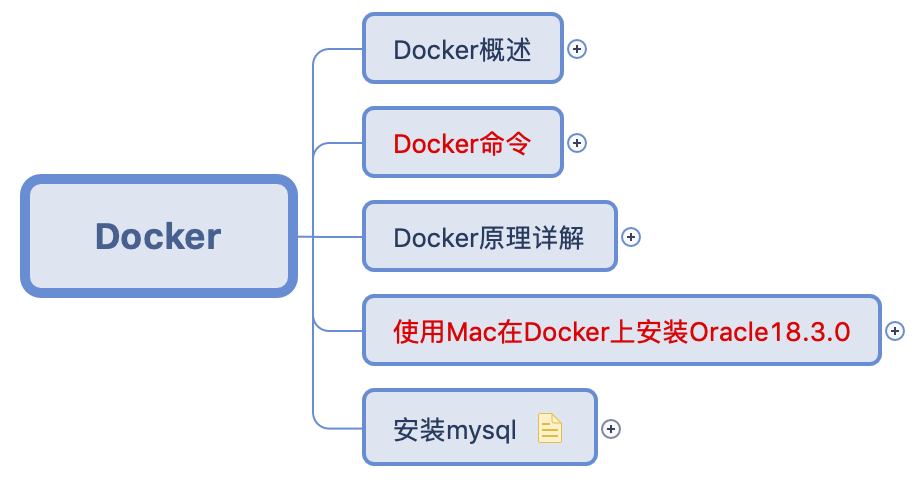

## Database

### MySQL

`MySQL`目前需要更新的地方仍然很多，目前有一份依照`DDL、DML及DCL`思路进行制作的说明文档。

### Oracle

暂无

### Redis

`Redis`是一个开源的`key-value`式存储系统，配合关系型数据库做高速缓存，由于其拥有持久化能力,利用其多样的数据结构存储特定的数据是它的两个主要用途。

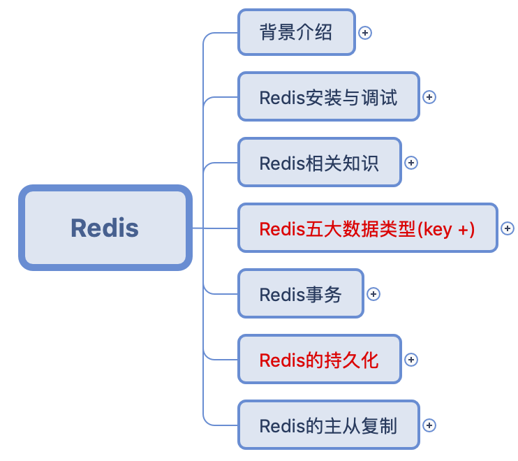

### HBase

#### 理论文件

`HBase` 作为基于 `hadoop` 的 `NoSQL` 数据库，其原理性和操作性的要求都比较强，在原理阶段讲解了 `HBase` 的逻辑结构和物理存储结构，以及针对于其结构进行优化的的操作手段。

#### 代码文件

`HBase`的代码文件是基于`HbaseAPI`操作搭建了一个微博项目，项目源码已写好，但具体分析文件还在制作中。

### ClickHouse

`ClickHouse`能够使用`SQL`查询实时生成分析数据报告，主要用于在线分析处理查询。

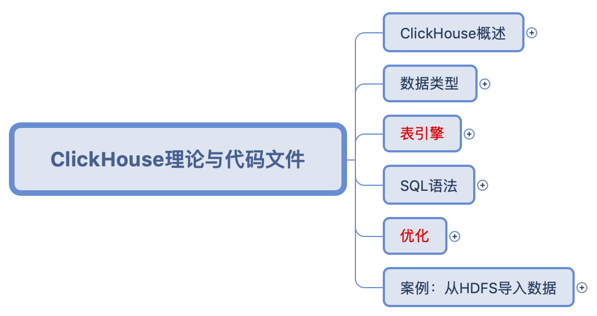

## DataX

`DataX`是一个异构数据源离线同步工具，致力于实现各种数据库间的数据同步功能，它的框架设计与`Flume`有些类似，通过`Reader`、`Framework`、`Writer`进行数据的转换同步，它的使用重点在于通过`json`的配置文件设定执行任务。

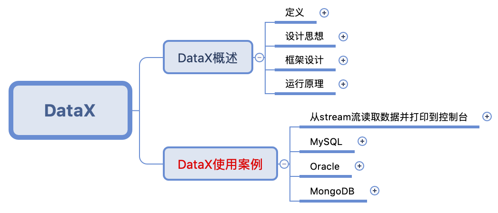

# 接入层

## Flume

`Flume`是一个基于流式架构数据采集、聚合和传输系统，因而它实用性较强，通过`Source` ，`Channel`，`Sink` 进行控制。所以我把它理论和代码文件归并。

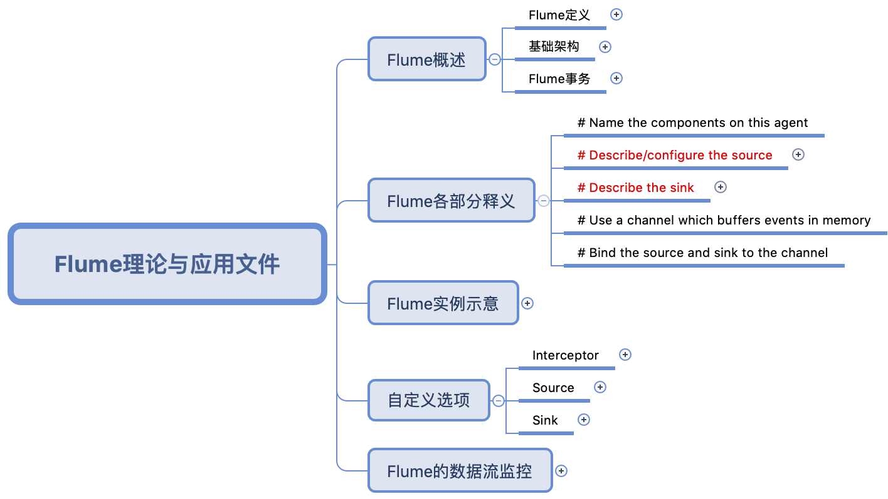

## Sqoop

`Sqoop` 是一个用于 `Hadoop` 和关系型数据库数据互导的小框架，其原理就是讲导入导出操作译作 `MapReduce` 语言，最关键的操作就是根据其语法进行脚本写作，因而理论与代码文件合并，同时整理出了 `Sqoop` 的常用命令。

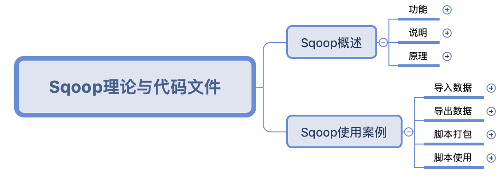

# 数据处理层

## 数据存储

### HDFS

#### 理论文件

`HDFS` 是 `Hadoop` 的基石，因此我把 `Hadoop` 的概述与它进行了合并，作为一个小简介，从而引出 `HDFS` ,`HDFS`的主要部分在于理解`NN`、`DN`、`Client`和`2NN`的运行机制。

#### 代码文件

已更新，主要是`hadoop`在`shell`命令行中的一些常用命令整理归纳

#### 备注

一些有关于`HDFS`的内容以及现有的知识结构图我不是很满意，在未来的版本会有更新，在近期内会进行更改一次。

### Yarn

暂未更新

## 数据计算

### MapReduce

#### 理论文件

`MapReduce` 是 `Hadoop` 中的分布式计算系统，在之后的内容中，有许多框架都是基于 `MapReduce` 所进行的，比如 `Oozie` ，比如 `Hive` ，因而理解 `MapReduce` 的原理是非常必要的。

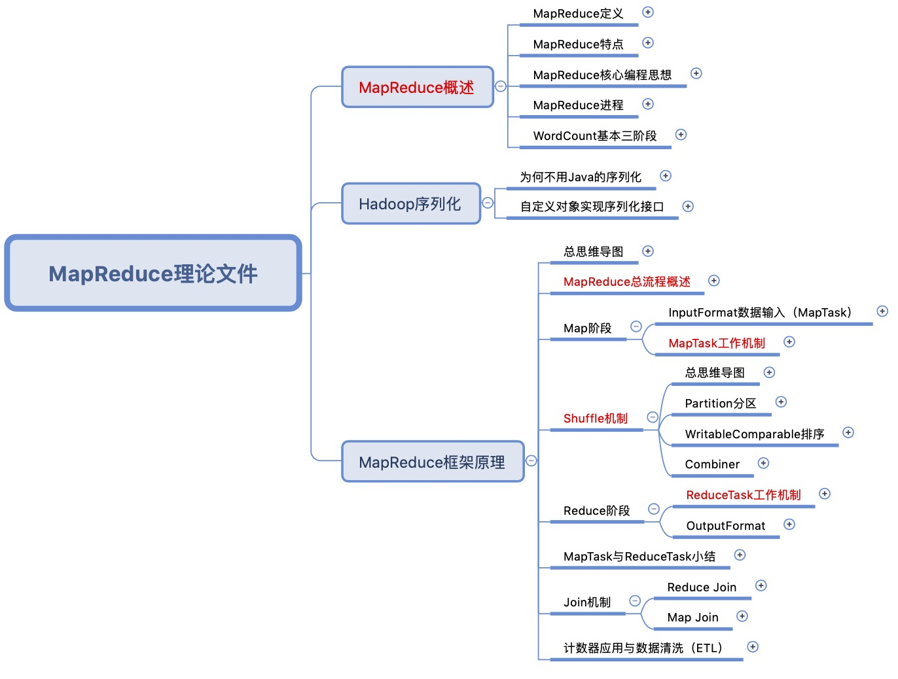

#### 代码文件

暂无

#### 备注

`MapReduce` 的知识框架整理方面，还是存在一些代码混杂于理论文件之中的情况，在接下来的版本中应该会对这一点进行更新。

### Spark

暂未更新

## 数据查询

### Hive

`Hive` 的情况恰恰与 `Zookeeper` 相反，`Hive` 作为一个基于 `Hadoop` 的数仓工具，其原理运作并不难，即底层基于 `MapRuduce` 的类 `SQL` 查询工具，因此 `Hive` 更注重的是代码文件，其中 `4 ~ 9` 章我以 `sql` 整理出来。

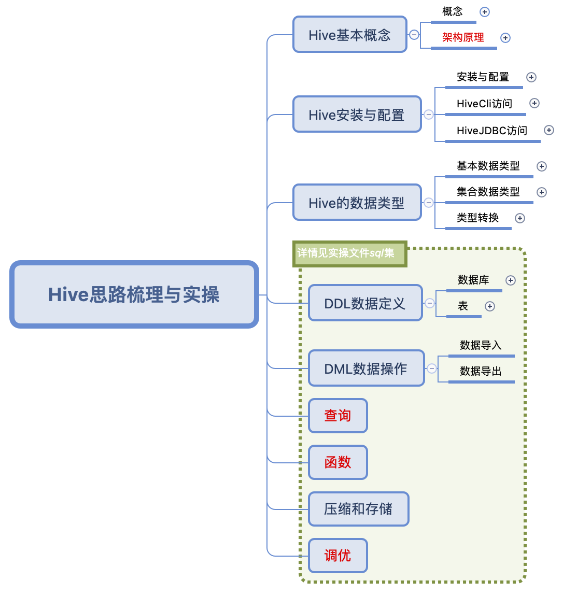

### Impala

暂未更新

## 任务调度

### Oozie

`Oozie` 是一个任务调度的小框架，其原理是把` xml` 语言转译为` mapreduce` 程序来做，但 `Oozie1` 只有` Map `阶段，此处我们归纳总结的是` Oozie1`。

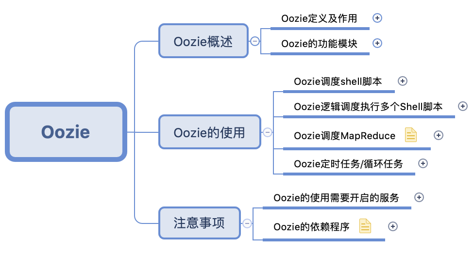

### Azkaban

`Azkaban`作为任务调度框架，其易用性无论从环境配置上来讲，以及配置文件的撰写上来讲，都要比`Oozie`更好。

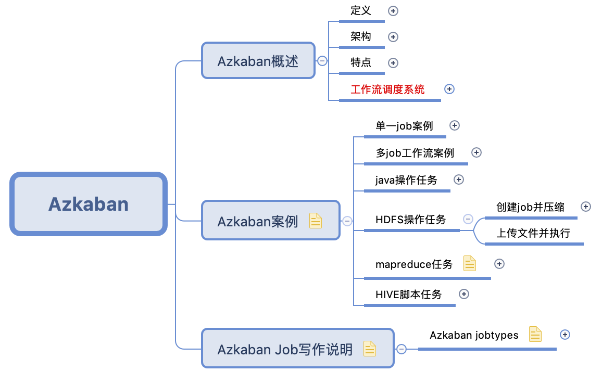

### Kettle

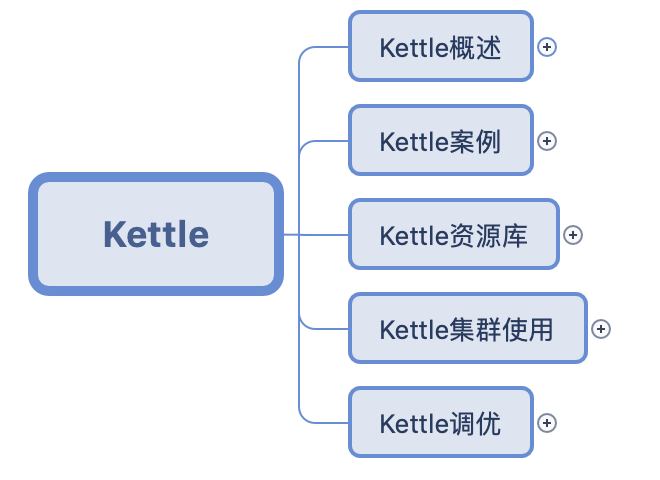

## 监控报警

### Zookeeper

`Zookeeper` 的主要目的是为了监控集群中的修改操作，它的架设与操作都非常简单，因此 `Zookeeper` 只有理论文件，在理论中，尤其要注意理解的是它的监听器原理和选举机制（类 `Paxos` 算法）。

### Kafka

正在整理中，待更新

