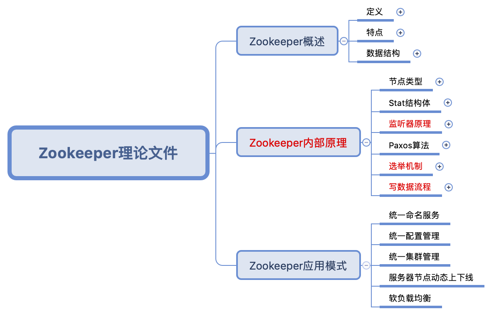

# Read me		

这是一份有关于 Hadoop 学习过程中各类知识点整理的思维导图，目前更新到 **Hive** 阶段。

针对每一个框架，思维导图的思路如下：

1.每一个框架我都会整理两个文件：理论文件和代码文件。（如无代码文件需要我会专门说明）

2.在理论文件中，我会解释清楚每个框架运作的原理，相应需要注意的细节点。在此部分中将不会或很少会出现代码。

3.在代码文件中，基于理论文件的理解，我会将理论文件中每一部分的功能具体实现写明，以便于在工作中可以直接查询或使用。

说明：红色标记的是重要点

## HDFS

### 理论文件

HDFS 是 Hadoop 的基石，因此我把 Hadoop 的概述与它进行了合并，作为一个小简介，从而引出 HDFS 。

### 代码文件

暂无，主要是 shell 方面的使用，端午后更新

### 备注

一些有关于 HDFS 的内容以及现有的知识结构图我不是很满意，在未来的版本会有更新，在近期内会进行更改一次。

## MapReduce

### 理论文件

MapReduce 是 Hadoop 中的分布式计算系统，尽管之后它被 Spark 组件替代了，但是理解它运作的原理是非常必要的。

### 代码文件

暂无，端午后更新

### 备注

MapReduce 的知识框架整理方面，还是存在一些代码混杂于理论文件之中的情况，在接下来的版本中应该会对这一点进行更新。

## Zookeeper

### 理论文件

Zookeeper 的主要目的是为了监控集群中的修改操作，它的架设与操作都非常简单，因此 **Zookeeper 只有理论文件**，在理论中，尤其要注意理解的是它的监听器原理和选举机制（类 Paxos 算法）。

## Hive

### 理论与代码文件

Hive 的情况恰恰与 Zookeeper 相反，Hive 作为一个基于 Hadoop 的数仓工具，其原理运作并不难，即底层基于 MapRuduce 的类 SQL 查询工具，因此 Hive 更注重的是代码文件，其中 4 ~ 9 章我以 sql 整理出来。

